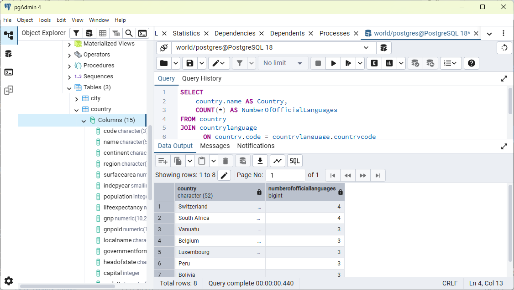
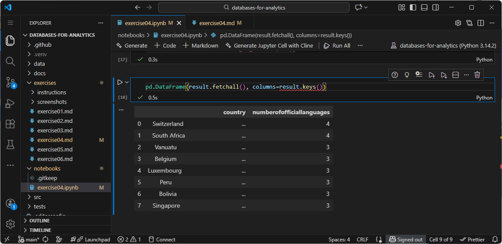
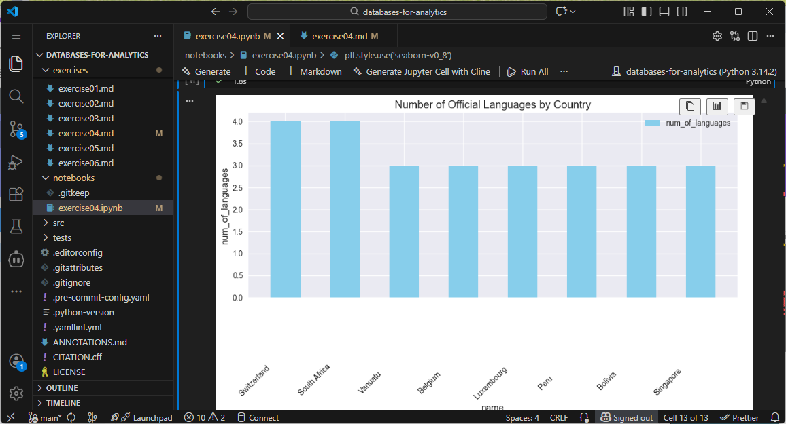

# Exercise 04: Advanced SQL, Jupyter, and Visualization

- Name: Terry Konkin
- Course: Database for Analytics
- Module: 4
- Database Used: World Database
- Tools Used: PostgreSQL, SQLAlchemy, Pandas, Jupyter Notebooks

---

## Instructions

- Complete each task using the **World database** installed earlier.
- For SQL questions:
  - Write the SQL command in a fenced code block
  - Execute the command and include a **screenshot of the results**
- For Jupyter Notebook questions:
  - Include the required Python statements
  - Include **screenshots of the notebook output**
- Store all screenshots in the `screenshots/` folder and embed them below each question.

---

## Question 1

Considering the World database, write a SQL statement that will **display the names of countries that speak more than two official languages**, along with the **number of official languages spoken**.

- Sort the results by **number of languages**, from **most to least**.
- *Hint: There are fewer than 10 countries in the results.*

### SQL

```sql
SELECT 
    country.name AS Country,
    COUNT(*) AS NumberOfOfficialLanguages
FROM country
JOIN countrylanguage
      ON country.code = countrylanguage.countrycode
WHERE countrylanguage.isofficial = 'T'
GROUP BY country.name
HAVING COUNT(*) > 2
ORDER BY NumberOfOfficialLanguages DESC;
```

### Screenshot



---

## Question 2

Using **Jupyter Notebooks**, you must use the `create_engine` command to connect to your database.

After the `create_engine` command is executed, **what are the three statements required to execute the query from Question 1 and display the results in the notebook**?

### Python Code

```python
# First Statement
conn = engine.connect()

# Second Statement
result = conn.execute(text("""SELECT 
    country.name AS Country,
    COUNT(*) AS NumberOfOfficialLanguages
FROM country
JOIN countrylanguage
      ON country.code = countrylanguage.countrycode
WHERE countrylanguage.isofficial = 'T'
GROUP BY country.name
HAVING COUNT(*) > 2
ORDER BY NumberOfOfficialLanguages DESC;"""))

# Third Statement
pd.DataFrame(result.fetchall(), columns=result.keys())

```

### Screenshot



---

## Question 3

Using **Jupyter Notebooks**, write the Python code needed to produce the following graph:


(The graph shows country-level results derived from the World database.)

### Python Code

```
query = text("""
    SELECT 
        country.name AS name,
        COUNT(*) AS num_of_languages
    FROM country
    JOIN countrylanguage
      ON country.code = countrylanguage.countrycode
    WHERE countrylanguage.isofficial = 'T'
    GROUP BY country.name
    HAVING COUNT(*) > 2
    ORDER BY num_of_languages DESC;
""")

with engine.connect() as conn:
    df = pd.DataFrame(conn.execute(query).fetchall(), columns=["name", "num_of_languages"])

plt.style.use('seaborn-v0_8')
fig, ax = plt.subplots(figsize=(10, 6))
bars = ax.bar(df['name'], df['num_of_languages'], width=0.5, color='skyblue', label='num_of_languages')

ax.set_xlabel('name', fontsize=12)
ax.set_ylabel('num_of_languages', fontsize=12)
ax.set_title('Number of Official Languages by Country', fontsize=14)
ax.legend()

plt.xticks(rotation=45)
plt.tight_layout()
plt.show()

```

### Screenshot


