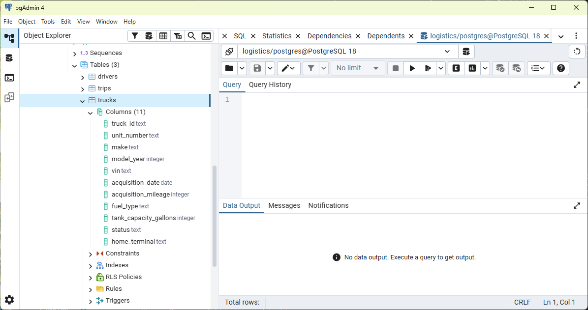
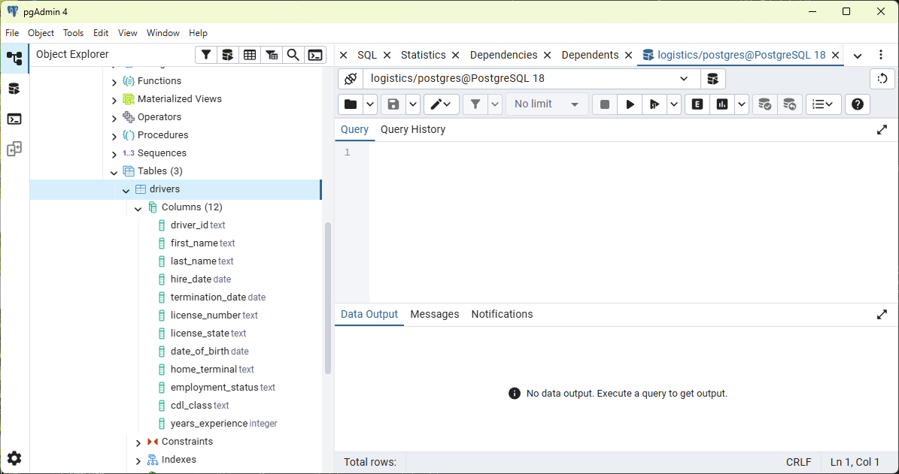
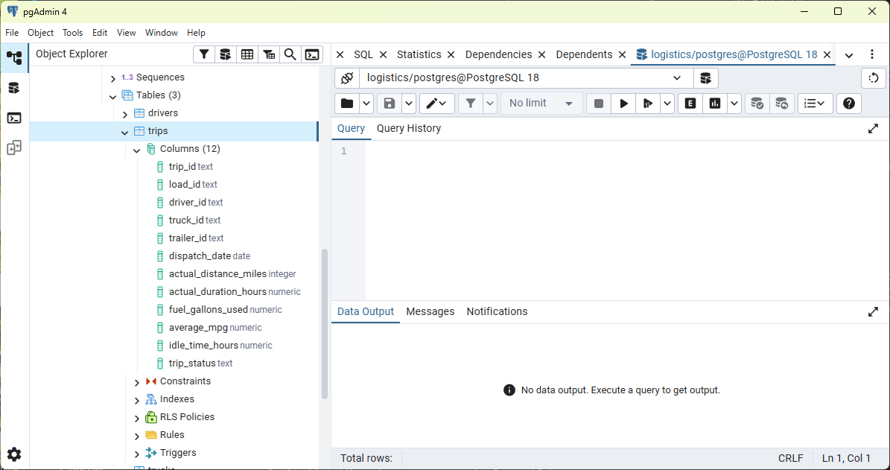
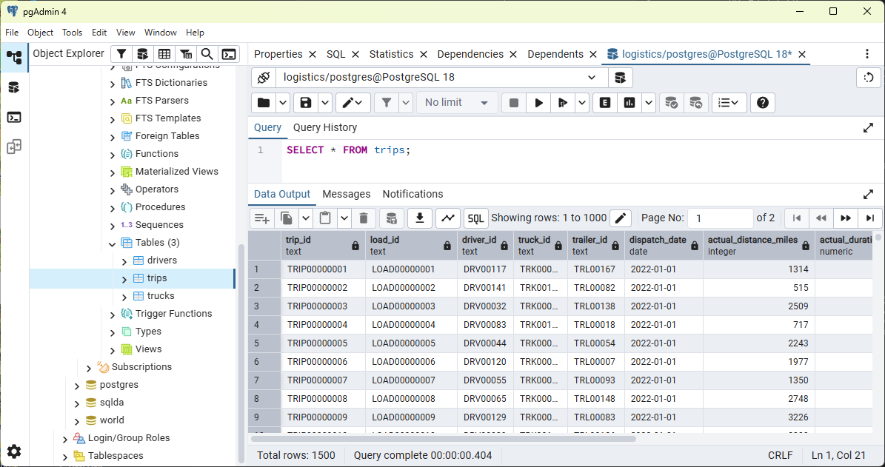
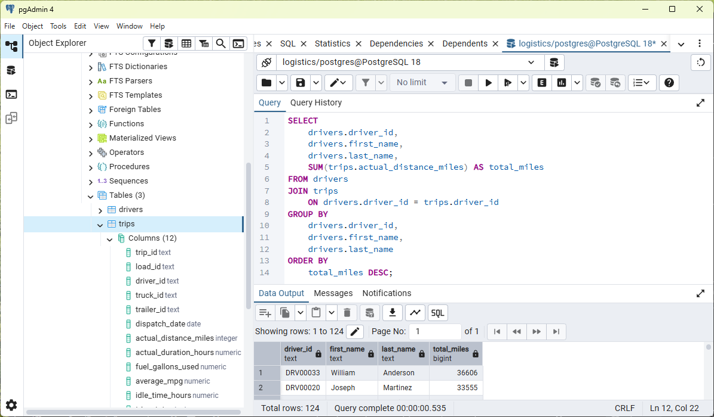

# Module 7 - Final Project: Show Us Your Data

- Name: Terry Konkin
- Course: Database for Analytics
- Module: 7
---

### The initial data source

The data source was selected from kaggle.com, and was selected as it complies with the module criteria in the 'Locating your Data' section.  The database is for a typical logistics/trucking business, to perform analytics of their operations.

The link to the data source is below:

https://www.kaggle.com/datasets/yogape/logistics-operations-database?resource=download

### The format of your data

The dataset is a csv format, comsisting of three tables selected from the source dataset, as described below.  

drivers:  12 cols, 150 rows
trucks:   11 cols, 120 rows
trips:    12 cols, 1,500 rows (note: source table = 57,000 rows)

### Show a data dictionary

trucks	    table name
truck_id	unique for each truck
unit_number	oprational number
make	    manufacturer name
model_year	year manufactured
vin	        VIN number of vehicle
acquisition_date	  date of vehickle purchase
acquisition_mileage	    mileage at time of purchase
fuel_type	            generally diesel
tank_capacity_gallons	size of fuel tank
status	              ctive/inactive/maintenance
home_terminal	        city where unit is based

drivers table name
driver_id   unique for each driver
fiest_name  driver name
last_name   driver name
hire_date   date that driver was hired
termination_date    date that driver left company
license_number  drivers license number
license_state   us state of drivers license
date_of_birth   birth date
home terminal   US city
employment_status   active/inactive/terminated
cdl_class   class of srivers license
years_experience    no. of years as commercial driver

trips       table name
trip_id     unique values
load_id     unique values
driver_id   driver associated with trip
truck_-id   truck used for trip
trailer_id  trailer used for trip
dispatch_date       start date of trip
actiual_distance    total miles travelled
actual_duration_hours   time to undertake trip
fuel_gallons_used       total fuel used for trip
average _mpg            miles per gallon
idle_time_hours time    that engine is running but truck not moving
trip_status             whether trip has been completed

### Describe some of the obstacles you overcame to transform the data.

Creating the column data types was fairly straightforward, and accomplished with CREATE TABLE statement.  I initially received an error message from the COPY statement, as apparently the files could not be accessed by postgres when in my downloads folder.  This was resolved by moving the files to the postgres folder to copy, and then deleting them afterward (although probably not standard procedure). 

### Show your table structure including data types

Trucks table structure is below:

Drivers table structure is below:

Trips table structure is below:

### Select * from each of your tables

Trucks table output is below:

Drivers table output is below:

Trips table output is below:

### Show some interesting queries from your tables.  Include:

### • At least one join

This query outputs all of the trips taken by a selected driver, including the miles driven for each of his trips.

### • At least one query where you group by and aggregate data

This query outputs all drivers, along with the total number of miles that each one has driven.

