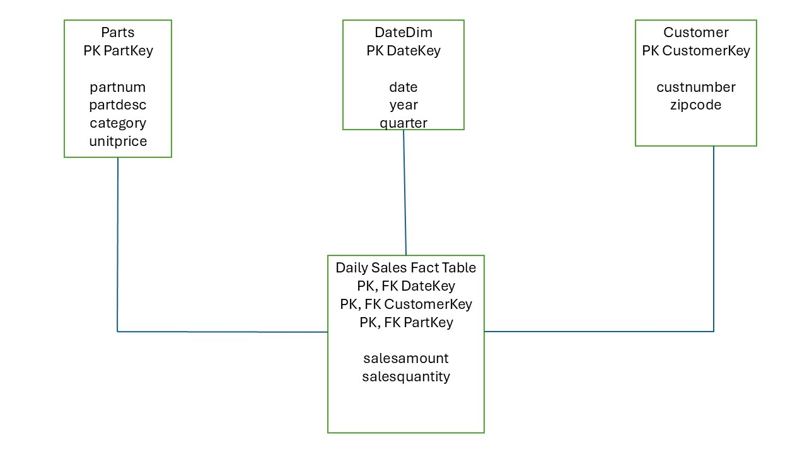

# Module 7 - Final Project: Show Us Your Data

- Name: Terry Konkin
- Course: Database for Analytics
- Module: 7

---

---

### The initial data source

The data source was selected from kaggle.com, and was selected as it complies with the module criteria in the 'Locating your Data' section.  The database is for a typical logistics/trucking business, to perform analytics of their operations.

The link to the data source is below:

https://www.kaggle.com/datasets/yogape/logistics-operations-database?resource=download

### The format of your data

The dataset is a csv format, comsisting of three tables selected from the source dataset, as described below.  

drivers:  12 cols, 150 rows
trucks:   11 cols, 120 rows
trips:    12 cols, 1,500 rows (note: source table = 57,000 rows)

### Show a data dictionary

trucks	    table name
truck_id	  unique for each truck
unit_number	oprational number
make	      manufacturer name
model_year	year manufactured
vin	        VIN number of vehicle
acquisition_date	  date of vehickle purchase
acquisition_mileage	mileage at time of purchase
fuel_type	            generally diesel
tank_capacity_gallons	size of fuel tank
status	              ctive/inactive/maintenance
home_terminal	        city where unit is based

- One **fact table** (daily customer sales facts)
- Appropriate **dimension tables** (you decide which ones are necessary)

Your model must clearly show:

- Fact table name and fields
- Dimension table names and fields
- Primary keys and foreign keys
- Relationships (dimensions connect to the fact table)

---

## Deliverables

### 1) Star Schema Diagram (Required)

Create and submit a **diagram** of your star schema.

You may use any tool, such as:
- draw.io (diagrams.net)
- PowerPoint
- Google Drawings
- Lucidchart
- Hand-drawn on paper (then take a clear photo)

Save your diagram image in this repo and embed it below.

**File name suggestion:** `star-schema.png` or `star-schema.jpg`

#### Diagram

---

### 2) Design Notes (Required)

In 1-2 short paragraphs, explain:

- What dimensions you chose and why
- Why your fact table grain is daily sales
- How your design supports at least 3 of the required analytics questions

#### Design Notes

Overall, the dimensions were chosen as a combination of what was available in the operational model, and the requirements specified in the list of questions to be answered.  By extension, no dimesions were included that were not required to answer the support questions.

The fact table grain is daily sales as that was the requirement specified in the assignment overview above.

Q1 - How many of part number **ax12** were sold on **September 2, 1994**?

A1 - Within the Part table, the part key and part number are available to perform the first query.  From the Date table, the date key for 09/02/1994 would be determined.  Then Daily Sales table is used to filter for both of those key values.  The resulting sales quantity value would be utilized for the answer to the question.

Q2 - How many of part number **ax12** did customer **124** purchase last year?

A2 - The query would utilize both the Parts table/part key for ax12 and Customer table/customer key for 124.  The DateDim table is used to filter all datekey rows with year = 2025.  Those datekeys, plus the 2 dimension keys are used to filter the DailySales table.  From that result, the rows in the sales quantity column are then aggregated.

Q3 - How much did customer **124** spend last year?

The Customer table can be used to identify the customerkey for custnumber 124.  The DateDim table is in the model to filter for rows with year = 2025.  Those two filters are then applied to the Daily Sales table.  For the resulting rows, the values in the salesamount column are aggregated to produce the answer.

